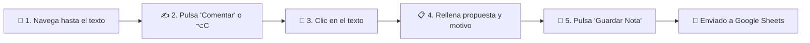

# 📘 Guía 101 · Modo Review y Feedback Editorial en VALNATIR

Bienvenido a la guía rápida de uso del **Modo Review de VALNATIR**. Esta herramienta permite al equipo y al grupo de control editorial revisar la web en vivo, seleccionar cualquier texto visualmente y proponer mejoras o correcciones que se registran de forma automática en la hoja compartida de Google Sheets.

---

## 🎯 1. ¿Para qué sirve el Modo Review?

* **Proponer textos alternativos:** Sugerir nuevas redacciones de titulares, párrafos, llamadas a la acción (CTAs) o menús.
* **Justificar cambios editoriales:** Indicar si un texto requiere mayor claridad comercial, corrección técnica, o adaptación legal/compliance.
* **Sincronización automática:** Cada nota que guardas se envía inmediatamente a la base de datos de control editorial sin que tengas que copiar, pegar ni rellenar hojas de cálculo manualmente.

---

## 🚀 2. Cómo activar el Modo Review

Existen tres formas muy sencillas de abrir la herramienta:

### Método A: El botón flotante (Recomendado)
En la esquina inferior derecha de cualquier página verás una píldora discreta:  
👉 Haz clic en **`[ 💬 Modo Review  ⌥C ]`**

### Método B: Atajo de teclado rápido
Pulsa la combinación de teclas en cualquier momento:
* **En Mac:** `Option (⌥)` + `C`
* **En Windows / Linux:** `Alt` + `C`

### Método C: Por enlace directo
Añade `?review=true` al final de cualquier dirección web (por ejemplo: `valnatir.com/?review=true`).

---

## 👤 3. Identificación inicial (Solo la 1ª vez)

La primera vez que abras el Modo Review en tu navegador, aparecerá un cuadro solicitando tu identidad:

> *"¡Bienvenido al Modo Review de VALNATIR!*  
> *Introduce tu Nombre / Email (ej. Enrique / enrique.barcos@almawolf.com):*  
> *(Solo se te pedirá esta primera vez)"*

1. Introduce tu **Nombre y Email corporativo**.
2. Pulsa **Aceptar**.
3. Tu navegador **recordará tu usuario para siempre**. No tendrás que volver a introducirlo en futuras sesiones ni al navegar entre páginas.

---

## 🧭 4. La Barra de Control Inferior

Al activarse, aparecerá una barra fija en la parte inferior de la pantalla con los siguientes controles:

| Control | Función | ¿Cuándo usarlo? |
| :--- | :--- | :--- |
| **`🧭 Navegar`** *(Por defecto)* | Modo de navegación habitual. Los enlaces, menús, carruseles y botones funcionan normalmente. | Úsalo para moverte entre páginas, explorar secciones o leer con tranquilidad sin recuadros de selección. |
| **`✍️ Comentar`** | Modo de inspección. Al pasar el ratón por los textos se iluminarán con un borde turquesa punteado. | Actívalo únicamente cuando veas un texto sobre el que quieras dejar una sugerencia o nota. |
| **`[ X notas ]`** | Contador que muestra cuántas notas has registrado en tu sesión. | Indicador informativo. |
| **`✕`** | Minimiza la barra y vuelve a la píldora flotante discreta. | Cuando quieras despejar la pantalla para ver el diseño limpio. |

> [!TIP]
> Puedes alternar entre **`🧭 Navegar`** y **`✍️ Comentar`** al instante pulsando **`⌥ + C`** (o `Alt + C`).

---

## 📝 5. Paso a Paso: Cómo dejar una nota de Feedback

### Paso 1: Localiza el contenido
Navega con la web en modo **`🧭 Navegar`** hasta encontrar el párrafo, titular o botón que quieras revisar.

### Paso 2: Activa el modo de comentarios
Haz clic en la pestaña **`[ ✍️ Comentar ]`** de la barra (o pulsa `⌥ + C`).

### Paso 3: Haz clic sobre el texto
Pasa el cursor sobre el texto que quieres comentar. Verás un **borde turquesa punteado** que te indica el bloque que vas a seleccionar. Haz clic sobre él.

### Paso 4: Completa el formulario
Se abrirá una ventana emergente con los siguientes apartados:

1. **`👤 Usuario`**: Aparece relleno automáticamente con tu nombre. *(Si necesitas corregirlo, puedes editarlo directamente aquí y se actualizará para las siguientes notas).*
2. **`Situación`**: Fijo en `Plan` (clasificación inicial para el equipo de desarrollo/copywriting).
3. **`Texto Actual en la Web`**: Muestra exactamente el texto original para que lo tengas como referencia.
4. **`Tu Propuesta de Texto (Opcional)`**: 
   * Viene precargado con el texto original.
   * Modifícalo para redactar tu alternativa sugerida.
   * Si no propones una redacción exacta y solo quieres hacer una consulta o crítica, puedes dejarlo como está.
5. **`Comentario o Justificación`**: Explica brevemente por qué sugieres este cambio (ej. *"Término demasiado técnico para el decisor financiero"*, *"Falta enfatizar el cumplimiento normativo DORA"*, *"Propuesta más directa"*).
6. **`Resolución / Observaciones (Opcional)`**: Anotaciones complementarias si procede.

### Paso 5: Pulsa «Guardar Nota»
* El modal se cerrará y el texto quedará subrayado suavemente para indicarte que ya ha sido revisado.
* En segundo plano, la nota se envía de forma inmediata a la hoja central de **Google Sheets**.
* Si deseas continuar navegando a otra sección, simplemente pulsa **`[ 🧭 Navegar ]`** o haz clic en cualquier enlace del menú.

---

## 💡 6. Buenas Prácticas para un Feedback Eficaz

1. **Sé específico en la propuesta:** Es mucho más ágil para el equipo editorial recibir una alternativa redactada lista para evaluar (*"Automatización continua del cumplimiento"* en vez de *"Cambiar esto porque no suena bien"*).
2. **Indica el motivo o contexto:** Aclarar si el cambio responde a un requisito legal/normativo, de posicionamiento comercial o de tono de marca ayuda al equipo a priorizar su aprobación.
3. **Cambia a `🧭 Navegar` para moverte:** Si necesitas cambiar de pestaña o abrir un menú desplegable, asegúrate de estar en **`🧭 Navegar`** para que el clic abra el menú en lugar del formulario de comentarios.
4. **Al navegar entre páginas:** Cada vez que entres a una nueva página de la web, el sistema estará automáticamente en modo **`🧭 Navegar`** para facilitarte la lectura. Cuando encuentres algo a corregir, pulsa `⌥ + C` y ¡a comentar!

---

## ❓ Preguntas Frecuentes (FAQ)

**¿Qué pasa si me equivoco al poner mi nombre en la primera pantalla?**  
No pasa nada. Al hacer clic en cualquier texto para comentar, en el campo `👤 Usuario` de la cabecera puedes borrarlo y escribir el correcto. Al guardar la nota, tu navegador guardará el nuevo usuario automáticamente.

**¿Tengo que pulsar algún botón de "Exportar" o "Guardar todo" al terminar?**  
No. Cada vez que pulsas *"Guardar Nota"*, el registro viaja instantáneamente a la hoja de Google Sheets. Puedes cerrar el navegador cuando quieras; nada se pierde.

**¿Cómo quito el recuadro verde cuando solo quiero leer?**  
Pulsa la pestaña **`🧭 Navegar`** en la barra inferior o presiona **`⌥ + C`** en tu teclado.
